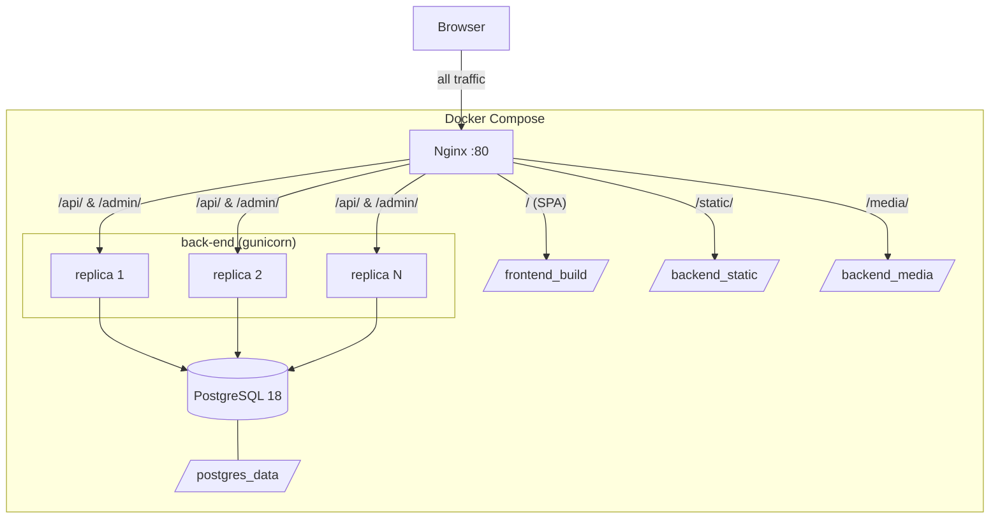
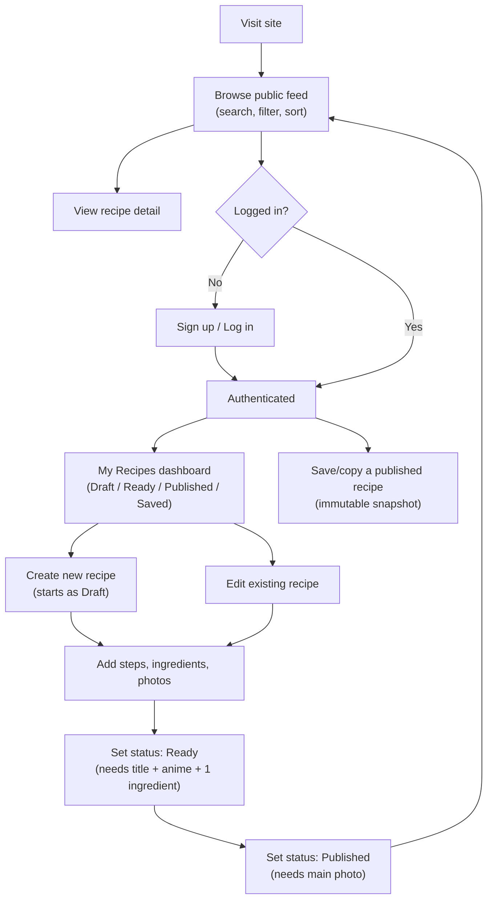

# Diagrams

All technical diagrams for the `animize_eat` project.

## Production Architecture

```mermaid
flowchart TD
    Browser["Browser"]

    Browser -->|"all traffic"| Nginx

    subgraph docker["Docker Compose"]
        Nginx["Nginx :80"]

        Nginx -->|"/api/ & /admin/"| backend1 & backend2 & backendN

        subgraph backend_pool["back-end (gunicorn)"]
            backend1["replica 1"]
            backend2["replica 2"]
            backendN["replica N"]
        end
        
        backend1 & backend2 & backendN --> DB

        DB[("PostgreSQL 18")]
        
        DB --- pg_vol

        pg_vol[/"postgres_data"/]

        Nginx -->|"/ (SPA)"| frontend_vol

        frontend_vol[/"frontend_build"/]

        Nginx -->|"/static/"| static_vol

        static_vol[/"backend_static"/]

        Nginx -->|"/media/"| media_vol

        media_vol[/"backend_media"/]
    end
```

## User Flow

```mermaid
flowchart TD
    Visit["Visit site"] --> Feed["Browse public feed\n(search, filter, sort)"]
    Feed --> ViewRecipe["View recipe detail"]
    Feed --> Auth{"Logged in?"}

    Auth -->|No| LoginSignup["Sign up / Log in"]
    LoginSignup --> AuthDone["Authenticated"]
    Auth -->|Yes| AuthDone

    AuthDone --> MyRecipes["My Recipes dashboard\n(Draft / Ready / Published / Saved)"]
    AuthDone --> SaveCopy["Save/copy a published recipe\n(immutable snapshot)"]

    MyRecipes --> Create["Create new recipe\n(starts as Draft)"]
    MyRecipes --> Edit["Edit existing recipe"]

    Create --> AddContent["Add steps, ingredients, photos"]
    Edit --> AddContent

    AddContent --> Ready["Set status: Ready\n(needs title + anime + 1 ingredient)"]
    Ready --> Publish["Set status: Published\n(needs main photo)"]
    Publish --> Feed
```
