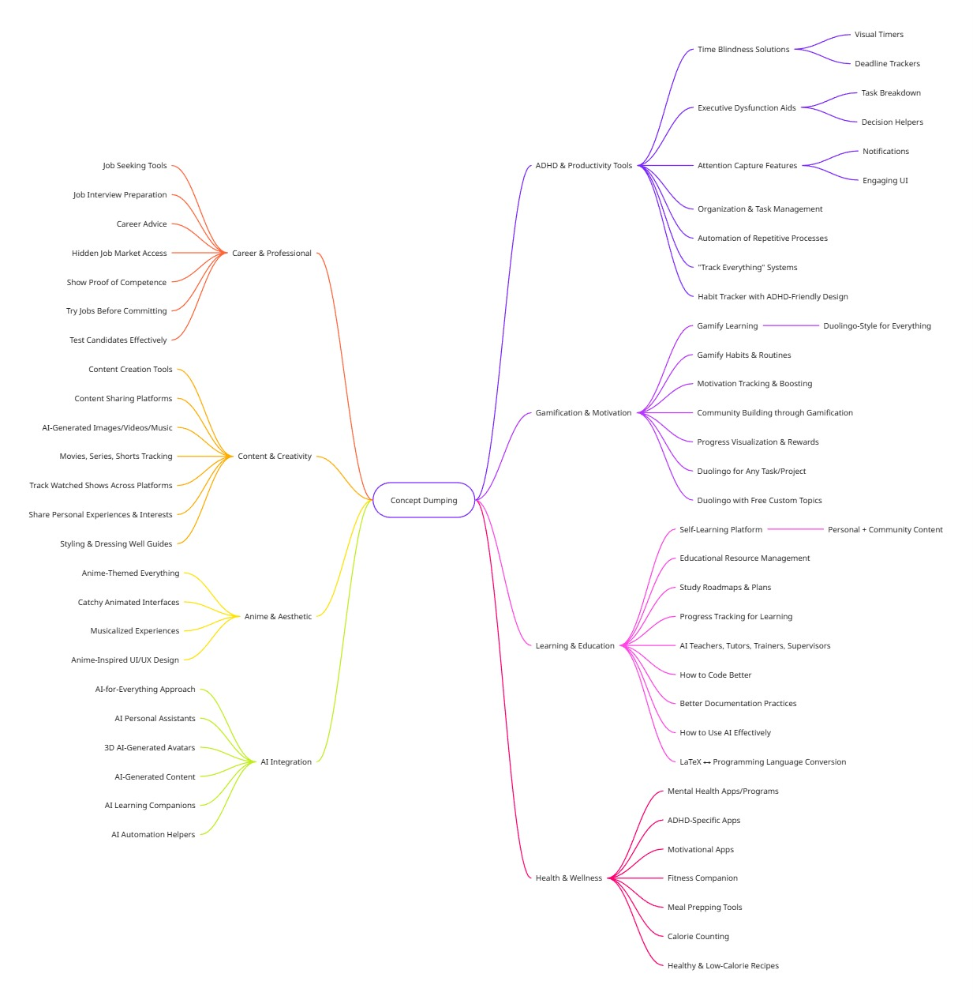

# Portfolio project - Stage 1: Team formation, brainstorming, and MVP
**Author:** [Xavier Laforgue](https://github.com/XavierLaforgue)

This report is meant for providing an overview on the team formation
process, list the ideas explored and give a summary of the chosen
Minimal Viable Product concept.

## Team formation & roles definition

### Team members
This is a solo project, therefore I ([Xavier Laforgue](https://github.com/XavierLaforgue)) am the only member of my team.

Due to the personal motivations of the members of the Holberton School
cohort of which I am part, all portfolio project "groups" are of
individual nature and such is also the case of this project.
### Roles
I will work alone and embody the role of a solo developer.
As a solo developer, and because this is a pedagogical experience to demonstrate my ability to design, execute, and finalize a software engineering project, I'll take on the multiple responsibilities (and embody the typical roles in charge of them) that concern carrying the entire SE project to its completion:
- Project manager: create plan, monitor project progression, identify and mitigate risks, correct plan and ensure deadlines are met.
- Team lead: coordinate tasks, make technical decisions, design technical architecture.
- Team member: idea generation, development, and documentation.
- Fullstack developer: develop software components, leverage free and low-cost services to deploy the application and streamline its delivery.
- UI designer: produce application mock-ups.
- Source code manager: document code, create integration tests.
#### External roles
I leverage the fact of following the Holberton School web development program to assign some roles to other members of the program:
- Students developing their own portfolio projects will serve as brainstorming partners and sources of feedback during ideation and decision-making.
- The local software developer [Sacha Schoumiloff](https://github.com/SChoumiloff) will serve as tutor and technical advisor, therefore they will provide mentorship, evaluate deliverables, and offer feedback.
He will also assess the final product and presentations based on the predefined rubrics.
### Stakeholders
There are three main stakeholders, all with a vested interest in the success of this project: 
- The pedagogical team: observers and reviewers of the learning experience.
- The tutor: technical advisor and evaluator of the product.
- Myself: product owner, manager and developer.
### Collaboration strategies:
Only partially applicable given that I work alone.
However, daily standups with the other "teams" to share progress,
request help, advice, and feedback will emulate the collaborative
experience/environment.
Progress will be reviewed every Wednesday and Friday so plans are adjusted with optional tutor input.
As means of communication with my tutor, Discord and in-person
discussions are expected on a regular basis.
Regular check-in's with other members of the pedagogical staff are expected in a weekly basis.
Project-wide decisions/choices will be documented in the corresponding app documentation (app README file).

## Brainstorming and idea evaluation

### Problems, trends, and existing solutions
For my individual research of project ideas, I started by searching inspiration on problems, trends, and existing tools/technologies/services.
I wrote down everything that came to mind, this is often referred to as braindumping.
This resulted in the list below.
- Organization
- Content sharing
- Gamification (for motivation, tracking, and creating community)
- Automation
- Capture attention
- Anime
- Catchy, animated, musicalized anything
- Mental health apps/programs
- ADHD apps
- Motivational apps
- Track everything
- Share everything
- Fitness companion
- Meal prepping
- Calorie counting
- Healthy recipes
- Low-calorie recipes
- Automate processes
- Gamify learning
- Gamify habits
- Habit tracker
- Share personal experiences
- Share interests
- AI for anything
- Content creation
- Movies, series
- AI-generated images/videos/music
- Dressing well/styling
- Jobseeking
- Job interview preparation
- Coding advice
- Better use of AI
- Better software documentation
- Educational resource management
- Learning platform for self-learners with personal and community driven content/resources (manage your own sources of knowledge and track your progress at studying them)/roadmaps/study plans and task tracking/gamification
- Career advice
- Hidden job market
- Show proof of competence for potential employers
- Job trials/professional immersions
- Test candidates
- Track watched shows across platforms
- AI-trainers
- AI-teachers
- AI-tutors/supervisors
- Conversion rendered latex <-> computing instructions/language
- Duolingo for everything
- Duoling with free learning topics
- Duolingo for any task/project
- AI personal assistant and avatar
- 3D AI-generated personal avatar

### Mindmapping
These ideas were used to produced a mindmap which helped to visualize connections and grouped items under common concepts or themes.

### Evaluation criteria
Making emphasis on personal preference, feasibility and technical alignment with my current experience and the technologies I want to have had a first experience at at the end of the web developer's track, I reduced the themes to the most relevant and their main ideas.
| Theme | Concept |
|-------|---------|
| Sharing  | Share recipes, share learning roadmaps and resources |
| Tracking | Track: watched shows, habits, tasks, used learning resource, home inventory |
| Planning | Plan meal preparation or shopping according to home inventory, plan laundry |
| Gamification | Gamify learning, habits, and other tasks |
| Learning | Visualize learning progress (dashboard), create community of learners, manage learning resources |
| Anime  | Use anime UI/UX |
|||

### Ideas explored
Choosing among the highlighted concepts and mixing and matching themes, the following ideas came up, ranked by feasibility, challenges, risks and impact (where 1 is the best case and 5 the worst, i.e., risk 1/5 is the best case of lowest risk):
1. **Anime-inspired recipe-sharing site** (f: 1/5, c: 1/5, r: 1/5, i: 4/5): create users, create recipes,
  create time tracker per cooking step when
  preparing a recipe, create nutritional information of ingredients,
  meal planning, track meals  and their nutritional content. Integrated
  shopping list.
2. **Hub for boardgame players to find game partners in the city** (f: 3/5, c: 2/5, r: 2/5, i: 3/5): create
  profiles with availability datetimes, create events, notify users
  that are available at that time, blacklist users.
3. **Anime inspired personal improvement web app** (f: 2/5, c: 4/5, r: 3/5, i: 2/5): gamify personal
  projects (medals, exp points), plot measurable progress, anime character delivering motivational phrases extracted from animes.
4. **Home inventory web app** (f: 4/5, c: 3/5, r: 4/5, i: 5/5): create inventory of products in different
  cathegories (fresh food, long-lasting food, cleaning supplies,
  laundry, office supplies, etc). Keep track of exhausted inventories. 
  Meal preparation linked to inventory of groceries and nutritional content.
5. **Learning resources management app with gamified progress tracking** (f: 5/5, c: 5/5, r: 5/5, i: 1/5): 
  group learning resources by project and tag, add notes for each resource, track progress in the use of the resource.

## Decision and refinement

### Summary of the selected MVP Concept
For practicality, as it ranked (in my opinion) highest in feasibility, challenges and risks (the last two meaning lower rank <-> higher challenge/risk), I chose the **Anime-inspired recipe-sharing site**.
#### Rationale
Anime has currently a large fanbase, a fanbase in adulthood, facing
adult challenges such as preparing meals that are healthy and tasty
while also avoiding boredom/repetition.
This website could help tackle this issue by offering interesting and
community approved recipes.
#### Potential impact
A community of curious anime fans wanting to experiment and create new
recipes inspired by their favorite shows may emerge.
Anime fans might be coerced to cook at home more often.
#### Problem it solves
Meal planning and boredom related to meal preparation.
#### Solution it provides
With community-generated recipes it simplifies meal planning and meal preparation.
The interactive steps and emotional connection to the anime that inspires the recipe will offer a measure of purpose and adventure, battling the boredom of preparing a regular meal.
#### Target audience
Fans of anime, home cooks looking for novelty.
#### Kind of application
Web application.
#### Why this idea over the others?
This idea ranked best overall in feasibility, challenges and risks; meaning it was the most practical choice for a project with fix deadlines and not much leeway.
#### Features and objectives of the MVP
A website where users can create an account and search for or share anime-inspired recipes.
Each recipe will dispose of step-by-step instructions, with or without
images for each step and a timer when one is necessary.
The quantities will be adapted according to the desired number of
portions.
Possibility to export the corresponding shopping list may be implemented.
| In-scope | Out-of-scope |
|----------|--------------|
| Interactive recipe creation. | Calendar for meal planning. |
| Interactive recipe preparation instructions. | Compiling shopping list for multiple recipes. |
| Adaptable quantity of ingredients to portion number. | Nutritional content of recipes. |
| Recipe saving and rating. | Non-owner recipe modification |
#### Risks, challenges, and mitigation
| Risk and challenges | Mitigation |
|---------------------|------------|
| Lack of experience with certain tools | Start using the tools as early as possible to identify difficulties and look for assistance |
| Lack of technical expertise on selected technologies for development | Take time before execution to learn the technologies. Follow targeted tutorials |
| Unclear method of tracking progress in recipe preparation | Apply local storage solution and test for practicality |
| Time management / out-of-scope time sinks | Strict MVP scope and weekly planning |
