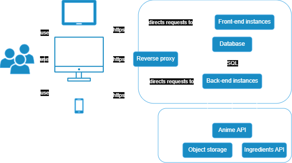
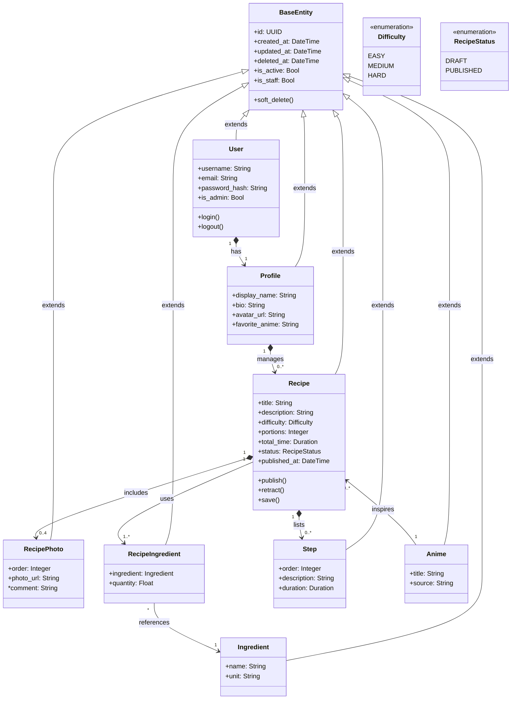
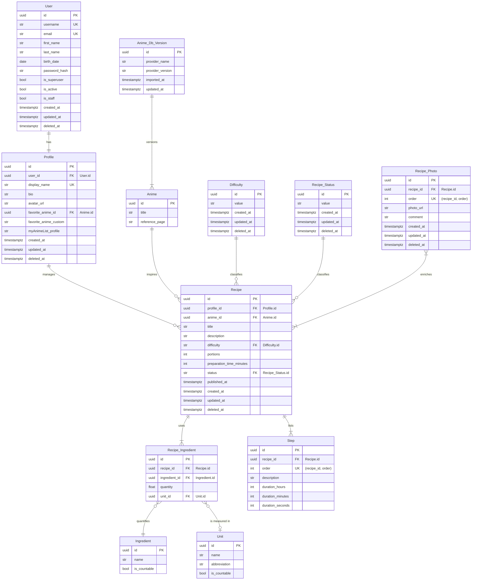

# Portfolio project - Stage 3: Technical Documentation
This documentation is meant to provide a detailed technical plan for the
development of the MVP, namely, an anime-inspired recipe-sharing
website.

## User stories and mockups

### User stories
The following are a list of **User Stories** in line with the
MVP, categorized by priority using the MoSCoW method:

#### Must have
- *As **an anime fan and a home cook**, I want to <u>create and log-in to an account</u> so that <u>I can save my favorite anime-inspired recipes</u>.*
- *As **a home cook**, I want to <u>browse and search for recipes</u> so that I can <u>find new meals to try</u>.*
- *As **a content creator**, I want to <u>submit and share anime-inspired recipes of my own creation with step-by-step instructions and images</u> so that <u>others can follow and recreate it</u>.*
- *As **any user**, I want to <u>experience a responsive and dynamic platform</u> so that <u>I can be comfortable and use the website with ease on any device</u>.*
  
#### Should have
- *As **an anime fan and a home cook**, I want to <u>filter recipes by ingredient, number of ingredients, preparation time, difficulty, and anime of inspiration</u> so that <u>I can find recipes that suit my needs</u>.*
- *As **a home cook**, I want to <u>leave reviews and ratings on recipes</u> so that <u>I can share feedback and help others choose</u>.*
- *As **a home cook**, I want to <u>adjust quantity of ingredients according to the desired number of portions</u> so that <u>I can cook for any number of people</u>.*
- *As **a home cook**, I want to <u>have a countdown timer already programmed with each step duration</u> such that <u>I won't need any other support tools (besides the cooking utensils, of course) other than the website to track the progress and simplify following the recipe</u>.*

#### Could have
- *As **a home cook**, I want to <u>bookmark or favorite recipes</u> so that <u>I can easily find them later</u>.*
- *As **a home cook**, I want to <u>follow other users or content creators</u> so that <u>I can see their latest recipes</u>.*

#### Won't have (for MVP)
- *As **a home cook**, I want to <u>view detailed nutritional information for each recipe</u> so that <u>I can make informed choices</u>.*
- *As **a home cook**, I want to <u>create a meal plan from selected recipes</u> so that <u>I can organize my weekly cooking</u>.*
- *As **a home cook**, I want to <u>export a shopping list based on my meal plan</u> so that <u>I can shop efficiently</u>.*
- *As **any user**, I want to <u>send direct messages to other users</u> so that <u>I can discuss recipes privately</u>.*
- *As **any user**, I want to <u>participate in forums or group chats</u> so that <u>I can engage in community discussions</u>.*
- *As **any user**, I want to <u>have access to a dedicated mobile app</u> so that <u>I can use the platform offline</u>.*

## System architecture


The system follows the typical architecture of a web application with a graphical UI.
Users may use desktop or mobile devices to access the web site communicating securely with a reverse proxy.
The reverse proxy redirects the requests to the front-end or the back-end, accordingly.
The front-end and back-end servers may be instantiated multiple times, scaling the service to satisfy demand.
The back-end uses external services to store user files, such as images, and to fill the database of recipe ingredients and anime titles.

## Components, classes, and database design
### Class diagram
%% #TODO: update class diagram to match new ER diagram 

### Entity-relationship diagram
%% #TODO: Verify if additional Uniqueness and Nullness details have been specified

### UI components
The UI is that of a single-page application with dynamic components.
The main views of the application will be:
- Homepage view with recipe cards
- Log-in view
- Sign-up view
- Profile creation/update view
- Profile view
- Recipe creation view
- Recipe view
- Creations view
- Saved view

The components of the front-end may be outlined as:
```
App
 ├── Layout
 │    ├── Header
 │    │    ├── Navbar
 │    │    └── Logo
 │    └── Footer
 └── Router
      ├── HomePage
      │    ├── RecipeSearchBar
      │    ├── RecipeFilterPanel
      │    │    └── RecipeFilter
      │    └── RecipeFeed
      │         └── RecipeCard
      ├── LogInPage
      ├── SignUpPage
      ├── UserDashBoardPage
      │    ├── TabPanel
      │    ├── AccountDetailsCard
      │    ├── ProfileEditorCard
      │    ├── ProfileCard
      │    ├── CreatedRecipesList
      │    │    └── RecipeCard
      │    └── SavedRecipesList
      │         └── RecipeCard
      ├── RecipeDetailsPage
      │    ├── RecipeMeta
      │    ├── IngredientList
      │    │    └── IngredientItem
      │    └── StepList
      │         └── StepItem
      │              └── StepTimer
      └── RecipeEditorPage
           ├── RecipeForm
           ├── IngredientEditor
           └── StepEditor
```

#### Main components (always present):
- App: global root component.
- Layout: global UI controls (changes the most between desktop and mobile displays).
  - Header: always at the top of the viewport.
    - Navigation bar: redirecting to different views.
    - Logo: platform logo redirecting to the homepage.
  - Footer: containing legal information on desktop or navigation on mobile devices. Visible when scrolling upwards or at the bottom of the page.
- Router: translating URIs into components.

#### HomePage components:
- HomePage: containing recipe pseudo-feed
- RecipeSearchBar: reduces the displayed recipes to those matching the input text and the active filters. Once pagination will be active, it will retrieve the recipes matching the filters and search query from the database.
- RecipeFilterPanel: allows to set the parameters of the search that the RecipeSearchBar will perform.
  - RecipeFilter: sets a specific recipe attribute to a certain value or values, such as difficulty, preparation time, and inspiring anime.
- RecipeFeed: vertical succession of recipes posted by users. Not a real feed for the MVP (no personalized suggestions, only listing of existing recipes marked as published). It retrieves a fix number of recipes from the database (or all of them before pagination is implemented).
  - RecipeCard: main recipe information (presentation card of the recipe) with images, title, duration, difficulty, and inspiring anime. It presents the data retrieved by RecipeFeed.

#### Account management components:
- SignUpPage: form to introduce account information (email and password). Form data to be sent to the *create user* back-end endpoint.  
- LogInPage: form to introduce login credentials (email and password). Form data is sent to the *log-in* back-end endpoint to authenticate the user (retrieve a JWT and store it in the cookies if the login is successful).
- UserDashBoardPage: page to access user related information and user actions.
  - TabPanel: panel to select the information to display. Performs the fetch operations for *account details*, *profile details*, *created recipes*, *saved recipes*, and *log-out*. The *log-out* operation would blacklist the refresh token and remove the current token fro the cookies.
  - AccountDetailsCard: displays user account details (email, username, real name) and a button to delete the acccount. Connects to the *delete user* back-end endpoint. 
  - ProfileEditorCard: form to modify or input (modify null fields) all profile information. Form data is sent to the *update profile* back-end endpoint.
  - ProfileCard:  displays profile information and a button to update it which bring forth the ProfileEditorCard.
  - CreatedRecipesList: lists all recipes created by the user and a button to create a new one which brings forth the RecipeEditorCard.
    - RecipeCard: displays summary of the corresponding recipe information, fetches the specific recipe on click of the card and uses data to bring forth and fill the RecipeDetailsPage. 
  - SavedRecipesList: lists recipes of other users that have been found on the feed and saved for future use. 
    - RecipeCard: same as the one in CreatedRecipesList.

#### Recipe management components:
- RecipeDetailsPage: displays all information of a recipe (photos, title, ingredients, steps, inspiring anime, etc). It is superposed over previous page content and it can be closed (X in corner) to recover the page as it was before accessing the recipe details. It has an *edit* button to bring forth the RecipeEditorPage if the user is the author of the recipe and a *save* button otherwise. 
  - RecipeAttributes: displays attributes of the recipe such as difficulty, inspiring anime, and total preparation time.
  - IngredientList: lists ingredients of the recipe with a modifiable number portions. 
    - IngredientItem: states quantity, unit of measurement, and name of the ingredient.
  - StepList: lists steps of the recipe in order.
    - StepItem: displays a description of the step and an associated timer if useful.
      - StepTimer: timer, with preset step duration, that may be started, paused, resumed, and reset.
- RecipeEditorPage: dynamic form to modify recipe data. Form data is sent to the *update recipe* back-end endpoint on submission.
  - RecipeForm: form to modify recipe attributes.
  - IngredientEditor: dynamic form (free number of fields) to modify recipe ingredients, their quantities and units of measurement.
  - StepEditor: dynamic form to modify recipe steps (instructions).

## External and internal APIs
### External APIs
For the MVP user-written ingredients and animes would be sufficient, but, if time allows, data of both would be used to feed the project's database from the public APIs:
-  [AniAPI](https://aniapi.com/docs/) or [AniDB](https://wiki.anidb.net/HTTP_API_Definition) or [AniList](https://github.com/AniList/ApiV2-GraphQL-Docs).
-  [Open Food Facts](https://world.openfoodfacts.org/data) or [edamam nutrition](https://developer.edamam.com/edamam-docs-nutrition-api) or [chomp](https://chompthis.com/api/).
When the database is not available for download the API would be used directly when the user would require the data.

### Internal APIs
All API endpoints will be prefixed by `/api/`.
When authentication will be required, an authorization header with a token will be used.

#### Authentication
<table>
  <tr>
    <th colspan="2"><code>POST /api/auth/register/</code></th>
  </tr>
  <tr>
    <td>Input (JSON)</td>
    <td>Output (JSON)</td>
  </tr>
  <tr>
    <td><pre><code>
{
  "username": "string",
  "email": "string",
  "password": "string"
}
    </code></pre></td>
    <td><pre><code>
{
  "id": "uuid",
  "username": "string",
  "email": "string"
}
    </code></pre></td>
  </tr>
</table>

<table>
  <tr>
    <th colspan="2"><code>POST /api/auth/login/</code></th>
  </tr>
  <tr>
    <td>Input (JSON)</td>
    <td>Output (JSON)</td> 
  </tr>
  <tr>
    <td><pre><code>
{
  "email": "string",
  "password": "string"
}
    </code></pre></td>
    <td><pre><code>
{
  "access_token": "jwt",
  "refresh_token": "jwt",
  "user": {
    "id": "uuid",
    "username": "string"
  }
  "profile": {
    "avatar_url": "string",
    "display_name": "string"
  }
}
    </code></pre></td>
  </tr>
</table>

<table>
  <tr>
    <th colspan="2"><code>POST /api/auth/refresh/</code></th>
  </tr>
  <tr>
    <td>Input (JSON)</td>
    <td>Output (JSON)</td>
  </tr>
  <tr>
    <td><pre><code>
{
  "refresh_token": "jwt"
}
    </code></pre></td>
    <td><pre><code>
{
  "access_token": "jwt"
}
    </code></pre></td>
  </tr>
</table>

<table>
  <tr>
    <th colspan="2"><code>POST /api/auth/logout/</code></th>
  </tr>
  <tr>
    <td>Input (JSON)</td>
    <td>Output (JSON)</td>
  </tr>
  <tr>
    <td>
      <pre><code>
{
  "refresh_token": "jwt"
}
    </code></pre></td>
    <td><pre><code>
{
  "detail": "string"
}
    </code></pre></td>
  </tr>
</table>

#### User account

#### Recipes

