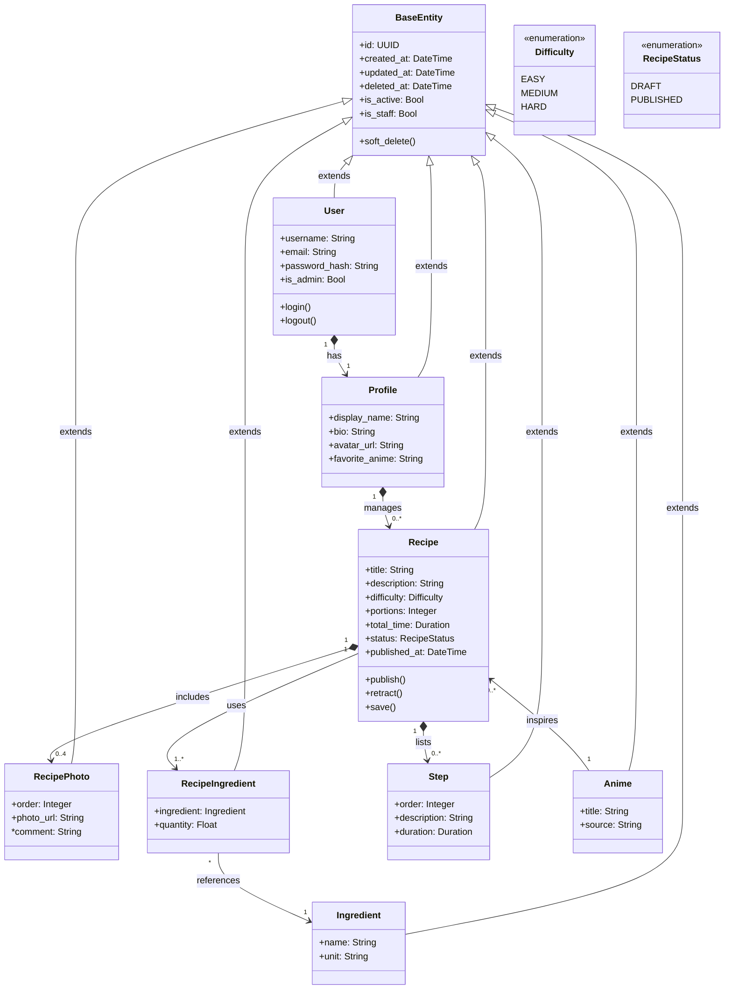
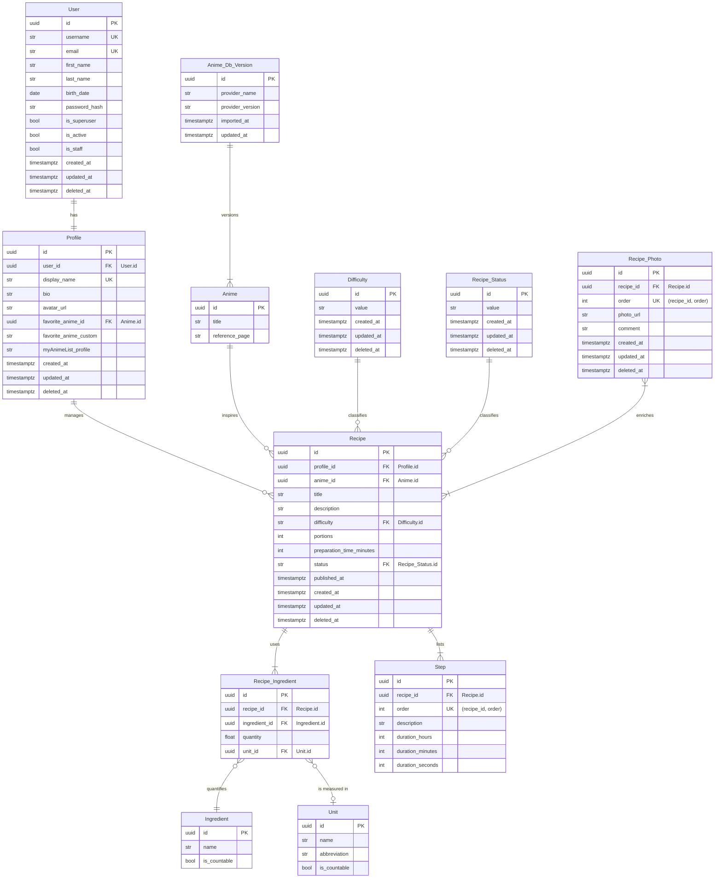

# Portfolio project - Stage 3: Technical Documentation
This documentation is meant to provide a detailed technical plan for the
development of the MVP, namely, an anime-inspired recipe-sharing
website.

## User stories and mockups

### User stories
The following are a list of **User Stories** in line with the
MVP, categorized by priority using the MoSCoW method:

#### Must have
- *As **an anime fan and a home cook**, I want to <u>create and log-in to an account</u> so that <u>I can save my favorite anime-inspired recipes</u>.*
- *As **a home cook**, I want to <u>browse and search for recipes</u> so that I can <u>find new meals to try</u>.*
- *As **a content creator**, I want to <u>submit and share anime-inspired recipes of my own creation with step-by-step instructions and images</u> so that <u>others can follow and recreate it</u>.*
- *As **any user**, I want to <u>experience a responsive and dynamic platform</u> so that <u>I can be comfortable and use the website with ease on any device</u>.*
  
#### Should have
- *As **an anime fan and a home cook**, I want to <u>filter recipes by ingredient, number of ingredients, preparation time, difficulty, and anime of inspiration</u> so that <u>I can find recipes that suit my needs</u>.*
- *As **a home cook**, I want to <u>leave reviews and ratings on recipes</u> so that <u>I can share feedback and help others choose</u>.*
- *As **a home cook**, I want to <u>adjust quantity of ingredients according to the desired number of portions</u> so that <u>I can cook for any number of people</u>.*
- *As **a home cook**, I want to <u>have a countdown timer already programmed with each step duration</u> such that <u>I won't need any other support tools (besides the cooking utensils, of course) other than the website to track the progress and simplify following the recipe</u>.*

#### Could have
- *As **a home cook**, I want to <u>bookmark or favorite recipes</u> so that <u>I can easily find them later</u>.*
- *As **a home cook**, I want to <u>follow other users or content creators</u> so that <u>I can see their latest recipes</u>.*

#### Won't have (for MVP)
- *As **a home cook**, I want to <u>view detailed nutritional information for each recipe</u> so that <u>I can make informed choices</u>.*
- *As **a home cook**, I want to <u>create a meal plan from selected recipes</u> so that <u>I can organize my weekly cooking</u>.*
- *As **a home cook**, I want to <u>export a shopping list based on my meal plan</u> so that <u>I can shop efficiently</u>.*
- *As **any user**, I want to <u>send direct messages to other users</u> so that <u>I can discuss recipes privately</u>.*
- *As **any user**, I want to <u>participate in forums or group chats</u> so that <u>I can engage in community discussions</u>.*
- *As **any user**, I want to <u>have access to a dedicated mobile app</u> so that <u>I can use the platform offline</u>.*

### Mockups

## System architecture

The system follows the typical architecture of a web application with a graphical UI.
Users may use desktop or mobile devices to access the web site communicating securely with a reverse proxy.
The reverse proxy redirects the requests to the front-end or the back-end, accordingly.
The front-end and back-end servers may be instantiated multiple times, scaling the service to satisfy demand.
The back-end uses external services to store user files, such as images, and to fill the database of recipe ingredients and anime titles.

## Components, classes, and database design
### Class diagram
%% #TODO: update class diagram to match new ER diagram 

### Entity-relationship diagram

